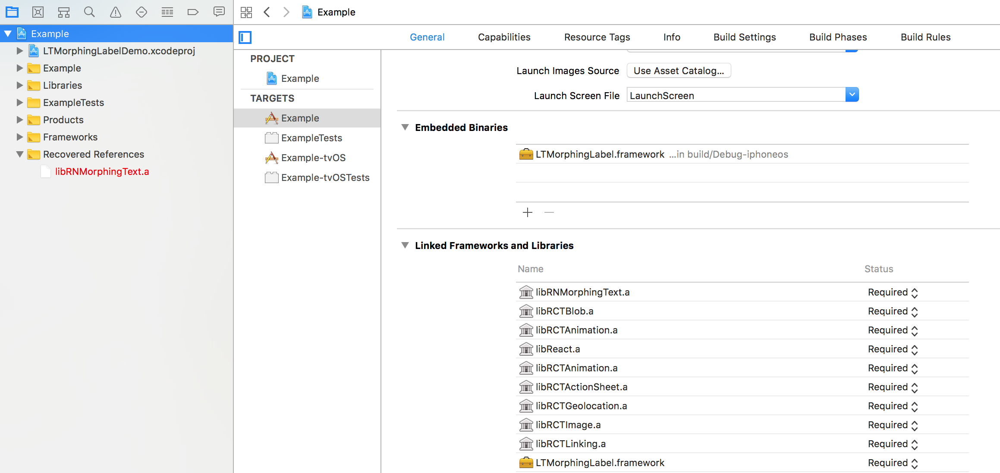

<p align="center"><b><i>Scale</i></b>
<br/>
<p>


<p align="center"><b><i>Evaporate</i></b>
<br/>
</p>


<p align="center"><b><i>Fall</i></b>
<br/>
</p>

<p align="center"><b><i>Pixelate</i></b>
<br/>
</p>

<p align="center"><b><i>Sparkle</i></b>
<br/>
</p>

<p align="center"><b><i>Burn</i></b>
<br/>
</p>

<p align="center"><b><i>Anvil</i></b>
<br/>
</p>

<p align="center"><b><i>Line</i></b>
<br/>
</p>

<p align="center"><b><i>Typer</i></b>
<br/>
</p>

<p align="center"><b><i>Ranbow</i></b>
<br/>
</p>

<p align="center"><b><i>Fade</i></b>
<br/>
</p>


<p align="center">
  <a href="https://www.npmjs.com/package/react-native-morphing-text"></a>
  <a href="https://github.com/prscX/react-native-morphing-text/pulls"></a>
  <a href="https://github.com/prscX/react-native-morphing-text#License"></a>
</p>

# React Native: Native Morphing Text

A Morphing React Native Text View. This library is a RN Bridge wrapper around [lexrus/LTMorphingLabel](https://github.com/lexrus/LTMorphingLabel) & [hanks-zyh/HTextView](https://github.com/hanks-zyh/HTextView)


## Getting started

`$ npm install react-native-morphing-text --save`

`$ react-native link react-native-morphing-text`

- **Android**

Please add below snippet into your app build.gradle

```

buildscript {
    repositories {
        jcenter()
        google()
    }
    ...
}


allprojects {
    repositories {
        mavenLocal()
        jcenter()
        google()
        ...
    }
}

```

> This library is supported Android SDK 27 > above

- **iOS**

  - Add `LTMorphingLabel` in Embedded Binaries & Linked Frameworks and Libraries. You can find this library from below path:

    `node_modules/react-native-morphing-text/ios/LTMorphingLabel/LTMorphingLabelDemo.xcodeproj`

    

  - Please Enable: `Build Settings > Build Options > Always Embed Swift Standard Libraries` to `true`

## Usage

```javascript
import RNMorphingText from 'react-native-morphing-text';

<RNMorphingText effect={"scale"}>{'Text'}</RNMorphingText>

```

## Props

- **Scale:** (iOS, Android) - Default

| Prop              | Type       | Default | Note                                                                                                       |
| ----------------- | ---------- | ------- | ---------------------------------------------------------------------------------------------------------- |
| `effect`       | `string`     |   scale      | Scale Effect Type
| `color`       | `string`     |   #000000      | Color of font
| `size`       | `number`     |    12     | Size of font


- **Evaporate:** (iOS, Android)

| Prop              | Type       | Default | Note                                                                                                       |
| ----------------- | ---------- | ------- | ---------------------------------------------------------------------------------------------------------- |
| `effect`       | `string`     |   evaporate      | Scale Effect Type
| `color`       | `string`     |   #000000      | Color of font
| `size`       | `number`     |    12     | Size of font


- **Fall:** (iOS, Android)

| Prop              | Type       | Default | Note                                                                                                       |
| ----------------- | ---------- | ------- | ---------------------------------------------------------------------------------------------------------- |
| `effect`       | `string`     |   fall      | Scale Effect Type
| `color`       | `string`     |   #000000      | Color of font
| `size`       | `number`     |    12     | Size of font


- **Pixelate:** (iOS)

| Prop              | Type       | Default | Note                                                                                                       |
| ----------------- | ---------- | ------- | ---------------------------------------------------------------------------------------------------------- |
| `effect`       | `string`     |   pixelate      | Scale Effect Type
| `color`       | `string`     |   #000000      | Color of font
| `size`       | `number`     |    12     | Size of font


- **Sparkle:** (iOS)

| Prop              | Type       | Default | Note                                                                                                       |
| ----------------- | ---------- | ------- | ---------------------------------------------------------------------------------------------------------- |
| `effect`       | `string`     |   sparkle      | Scale Effect Type
| `color`       | `string`     |   #000000      | Color of font
| `size`       | `number`     |    12     | Size of font


- **Burn:** (iOS)

| Prop              | Type       | Default | Note                                                                                                       |
| ----------------- | ---------- | ------- | ---------------------------------------------------------------------------------------------------------- |
| `effect`       | `string`     |   burn      | Scale Effect Type
| `color`       | `string`     |   #000000      | Color of font
| `size`       | `number`     |    12     | Size of font


- **Anvil:** (iOS)

| Prop              | Type       | Default | Note                                                                                                       |
| ----------------- | ---------- | ------- | ---------------------------------------------------------------------------------------------------------- |
| `effect`       | `string`     |   anvil      | Scale Effect Type
| `color`       | `string`     |   #000000      | Color of font
| `size`       | `number`     |    12     | Size of font


- **Line:** (Android)

| Prop              | Type       | Default | Note                                                                                                       |
| ----------------- | ---------- | ------- | ---------------------------------------------------------------------------------------------------------- |
| `effect`       | `string`     |   line      | Scale Effect Type
| `color`       | `string`     |   #000000      | Color of font
| `size`       | `number`     |    12     | Size of font
| `lineColor`       | `string`     |    #1367bc     | Line Color
| `lineWidth`       | `number`     |    4     | Width of Line


- **Typer:** (Android)

| Prop              | Type       | Default | Note                                                                                                       |
| ----------------- | ---------- | ------- | ---------------------------------------------------------------------------------------------------------- |
| `effect`       | `string`     |   typer      | Scale Effect Type
| `color`       | `string`     |   #000000      | Color of font
| `size`       | `number`     |    12     | Size of font
| `typerSpeed`       | `number`     |    100     | Speed of Typing
| `charIncrease`       | `number`     |    2     | Char Increase


- **Ranbow:** (Android)

| Prop              | Type       | Default | Note                                                                                                       |
| ----------------- | ---------- | ------- | ---------------------------------------------------------------------------------------------------------- |
| `effect`       | `string`     |   ranbow      | Scale Effect Type
| `color`       | `array`     |   []      | Color of font
| `size`       | `number`     |    12     | Size of font
| `colorSpace`       | `number`     |    150     | Color Space
| `colorSpeed`       | `number`     |    5     | Speed of color changing


- **Fade:** (Android)

| Prop              | Type       | Default | Note                                                                                                       |
| ----------------- | ---------- | ------- | ---------------------------------------------------------------------------------------------------------- |
| `effect`       | `string`     |   fade      | Scale Effect Type
| `color`       | `string`     |   #000000      | Color of font
| `size`       | `number`     |    12     | Size of font

## Credits
- **Android:** [hanks-zyh/HTextView](https://github.com/hanks-zyh/HTextView)
- **iOS:** [lexrus/LTMorphingLabel](https://github.com/lexrus/LTMorphingLabel)

## Contribution
Contributions are welcome and are greatly appreciated! Every little bit helps, and credit will always be given.

## License
This library is provided under the Apache License.

RNMorphingText @ Pranav Raj Singh Chauhan
